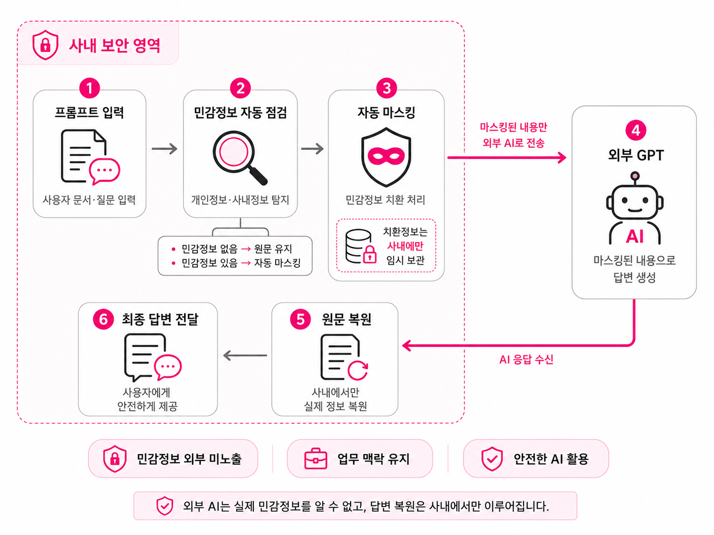

# 🛡️ SafeMask AI Agent

회사자료를 생성형 AI에 더 안전하게 활용하기 위한  
**민감정보 마스킹 기반 업무용 AI Agent** 프로젝트입니다.

SafeMask AI Agent는 문서, 로그, SQL, 업무 메모 등에 포함될 수 있는 개인정보와 업무상 민감정보를
AI 전송 전에 먼저 마스킹하고, 마스킹된 데이터만 GPT API에 전달하는 보안형 AI 서비스입니다.

사용자는 일반 GPT처럼 채팅 화면에서 자료 정리, 문장 개선, 오류 확인, 원인 분석 등을 요청할 수 있으며,
서비스는 민감정보 노출 부담을 줄이면서 업무자료 기반의 AI 활용을 돕는 것을 목표로 합니다.

<br>

> **Mask first, ask safely.**  
> 민감정보는 가리고, AI 활용은 더 편하게.

---

## ✨ Service Concept

SafeMask는 단순 챗봇이 아니라, 회사자료를 AI에 입력하기 전 한 번 더 보호하는 업무용 AI Agent입니다.

사용자가 입력하거나 업로드한 자료는 서버에서 먼저 분석되며, 이름, 연락처, 이메일, 사번, 내부 IP,
DB 계정, 거래처명 등 외부 AI에 그대로 전달하기 어려운 정보는 토큰 형태로 치환됩니다.

이후 사용자는 마스킹된 내용을 확인한 뒤 GPT API 전송을 승인할 수 있습니다.
AI 응답은 다시 서비스 화면에서 자연스럽게 확인할 수 있도록 처리됩니다.

---

## 🚀 Tech Stack

### Backend


### View


### Database / Cache


### AI / File


### Collaboration


---

## 🧭 Architecture



AWS EC2와 NGINX HTTPS 임시 배포 절차는
[AWS HTTPS 배포 가이드](docs/AWS_HTTPS_DEPLOYMENT.md)를 참고하세요.

---

## 📁 프로젝트 구조

프로젝트 구조는 기능 구현 과정에서 변경될 수 있습니다.

```text
safemask
├─ src
│  ├─ main
│  │  ├─ java
│  │  │  └─ haitai
│  │  │     └─ safemask
│  │  │        ├─ domain              # 비즈니스 도메인
│  │  │        │  ├─ chat             # 채팅
│  │  │        │  ├─ masking          # 민감정보 마스킹
│  │  │        │  ├─ ai               # GPT 연동
│  │  │        │  └─ file             # 파일 처리
│  │  │        │
│  │  │        └─ global              # 공통 모듈
│  │  │           ├─ config           # 전역 설정
│  │  │           ├─ security         # 보안 설정
│  │  │           ├─ exception        # 예외 처리
│  │  │           └─ common           # 공통 유틸
│  │  │
│  │  └─ resources
│  │     ├─ templates                 # Thymeleaf
│  │     ├─ static                    # 정적 리소스
│  │     └─ application.yaml          # 환경 설정
│  │
│  └─ test                            # 테스트 코드
│
├─ build.gradle
├─ settings.gradle
└─ README.md
```

---

# 📌 협업 규칙

## 🌿 브랜치 전략

우리 팀은 다음과 같은 브랜치 전략을 사용합니다.

- `main` : 안정 버전 관리 브랜치
- `develop` : 개발 통합 브랜치
- `demo` : 시연 및 테스트용 브랜치

### 작업 브랜치 전략

이슈 단위로 브랜치를 생성하고, 작업 완료 후 `develop` 브랜치로 병합합니다.

- 기능 개발 : `feat/{이슈번호}-{간단설명}`
- 버그 수정 : `fix/{이슈번호}-{간단설명}`
- 문서/설정 : `chore/{이슈번호}-{간단설명}` 또는 `docs/{이슈번호}-{간단설명}`

예시:

- `feat/8-masking-preview`
- `fix/12-token-restore-bug`
- `docs/15-update-readme`

### 기본 워크플로우

1. 이슈 생성
2. `develop` 기준으로 작업 브랜치 생성
3. 커밋 메시지에 이슈 번호 연동
4. `develop` 대상으로 PR 생성
5. PR 본문에 `Resolves #이슈번호` 작성
6. 코드 리뷰 후 `develop`에 머지
7. 필요 시 `develop`에서 `demo`, `main`으로 반영

---

## 📝 커밋 컨벤션

### 1️⃣ Commit Type

| Type | 설명 |
| --- | --- |
| **Feat** | 새로운 기능 추가 |
| **Fix** | 버그 수정 |
| **Docs** | 문서 수정 |
| **Style** | 코드 포맷팅, 세미콜론 누락 등 동작 영향 없는 수정 |
| **Refactor** | 코드 리팩토링 |
| **Test** | 테스트 코드 추가 또는 수정 |
| **Chore** | 빌드, 패키지 정리 등 기타 변경사항 |
| **Design** | UI/CSS 등 디자인 관련 수정 |
| **Comment** | 주석 추가 또는 변경 |
| **Init** | 프로젝트 초기 설정 |
| **Rename** | 파일 또는 폴더명 변경 |
| **Remove** | 파일 삭제 |

---

### 2️⃣ Subject Rule

- 제목은 **50자 이하**
- **마침표/불필요한 특수기호 사용 금지**
- 영문 사용 시 **동사 원형**, 첫 글자 대문자 사용
- **개조식 표현** 사용

---

### 3️⃣ Body Rule

- 한 줄 **72자 이하**
- "무엇을, 왜 변경했는지" 중심
- 선택 사항이지만 가급적 작성 권장

---

### 4️⃣ Footer Rule

형식:

```text
유형: #이슈번호
```

여러 개일 경우 쉼표로 구분합니다.

| 유형 | 설명 |
| --- | --- |
| **Fixes** | 이슈 수정 중 |
| **Resolves** | 이슈 해결 |
| **Ref** | 참고할 이슈 |
| **Related to** | 관련된 이슈 |

#### 예시

```text
Feat: Add masking preview

사용자가 GPT 전송 전 마스킹 결과를 확인할 수 있도록
미리보기 화면과 승인 흐름을 추가

Resolves: #12
```

---

## 👥 Team

| 이름 | 역할 |
| --- | --- |
| 홍왕기 | Full-stack Web / AI Agent |
| 함종규 | Full-stack Web / AI Agent |
